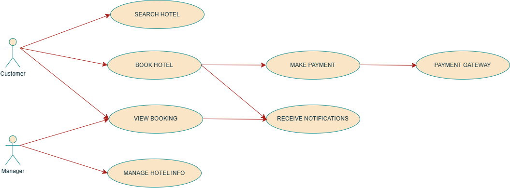

# Requirement Analysis in Software Development.

## Introduction

The purpose of this repository is to provide a comprehensive overview of requirement analysis in software development. It serves as a centralized resource for documenting and managing project requirements, facilitating effective communication among stakeholders, and ensuring the successful delivery of software projects. This repository will include best practices, methodologies, and tools related to requirement analysis, contributing to improved project outcomes.

### **Key Objectives:**

- Define what requirement analysis is.
- Define the importance of rewuirement analysis.
- Define Key Activities in Requirement Analysis
- Define the two types of requiremets the functional and non-functional requirements of a system.
- including the usecase diagram in requirement analysis.
- Write about the importance of Acceptance Criteria in Requirement Analysis.

## What is Requirement Analysis?

**Requirement Analysis** is an important phase in the software development lify cycle(SDLC) that includes identifying, understanding and documenting the specific needs and expectations of the end-user and stakeholders. it acts as a bridge between the initial idea and the final product.

**Importance of Requirement Analysis**

1. **Avoid Miscommunication:**
   Effective communication Ensures a shared understanding of the project scope and goals among the stakeholders and developers which develops clarity and understanding of the project.
2. **Establish Project Scope:**
   Define the boundaries of the system, what it includes, and what it will exclude which helps in preventing project creed.
3. **Cost and Time Estimation**
   Investing time upfront in requirement analysis can significantly reduce costs and time in the later stages of the development. By addressing potential issues early, teams can avoid costly changes and rework that ofter arise from unclear and incomplete requirements.
4. **Enhanced Quality Assurance**
   Requirement Analysis ensures that the final output meets the outlines specifications. The linkage between the requirements and testing helps maintain high quality and functionality in the final product.
5. **Enhanced Project Efficiency**
   Clear and concise requirements streamline the development process and reduce the likelihood of rework.

## Why is Requirement Analysis Important?

Requirement Analysis is a critical phase in the Software Development Life Cycle for the following reasons:

1. **Clarity and Precision of Requirements**
   Requirement analysis ensures that all project stakeholders have a clear and precise understanding of what the software should accomplish. this phase involves detailes discussions and documentation of user needs, businss goals and system functionalities.

   - **Importance:**
     - **Reduces Ambiguity:** By clearly defining requirements, the chances of misinterpretation are minimized, allowing developers to work with a well-understood scope.
     - **Guides Development:** Clear requirements serve as a roadmap for the development team, helping them focus on delivering features that meet user expectations.

2. **Cost and Time Efficiency**
   Investing time in requirement analysis can lead to significant cost and time savings throughout the software development lifecycle. By identifying and addressing potential issues early on, teams can avoid costly changes and delays later in the process.

- **Importance:**
  - **Prevents Scope Creep:** A well-defined set of requirements helps manage project scope, reducing the likelihood of adding unnecessary features that can derail timelines and budgets.
  - **Minimizes Rework:** When requirements are well understood from the start, the need for rework due to misunderstandings or incomplete specifications is greatly reduced, leading to more efficient project execution.

3. **Enhanced Quality Assurance**
   Requirement analysis lays the groundwork for effective quality assurance by providing a clear basis for testing and validation. Well-documented requirements allow QA teams to create thorough test cases that ensure the software meets user needs.

- **Importance:**

  - **Alignment with User Expectations:** Testing against clearly defined requirements ensures that the final product aligns with what users expect, enhancing user satisfaction.
  - **Facilitates Traceability:** Requirement analysis establishes a traceable relationship between requirements, design, and testing. This traceability allows teams to verify that all requirements have been addressed and helps identify any gaps in functionality.

  ## Key Activities in Requirement Analysis.

  ### **1. Requirement Gathering**

  This is the initial step in requirement analysis process where informations about the user needs, business goals and system functionalities are collected. This step helps to ensure no crutial information is missed at the start of the project.
  **Common techniques for gathering requirements**

  - **Interviews:** By conducting one to one or group interviews with stakeholders to gather all necessary informations, insights and preferences.
  - **Surveys and Questionnaires:** Distributing surveys to a broader audience to collect quantitative data from a large number of stakeholders on user needs.
  - **Workshops and Brainstorming Sessions:** Facilitating collaborative sessions with stakeholders to brainstorm and discuss requirements.
  - **Observation:** Observing current workflows and processes to identify pain points and areas for improvement.

  ### **2. Requirement Elicitation**

  This step helps in identifying and refining requirements, ensuring that ll relevant aspects are considered before moving forward in the development process.
  **Common techniques for requirement Elicitation**

  - **Interviews:** To understand stakeholder needs and expectations.
  - **Use Cases and User Stories:** Developing scenarios that describe how users will interact with the system, helping to clarify requirements.
  - **Brainstorming:** Conducting brainstorming sessions to generate ideas and gather requirements.
  - **Prototyping:** Creating early visual representations of the system to facilitate discussions and gather feedback on features and functionalities.
  - **Focus Groups:** Organizing sessions with selected users to discuss their needs and validate ideas.

  ### **3. Requirement Documentation**

  Once requirements are gathered and elicited, they need to be documented in a clear and organized manner. Requirement documentation serves as a formal record of the project's scope and expectations.Proper documentation ensures that all stakeholders have a shared understanding of the requirements. It serves as a reference throughout the SDLC, aiding communication and reducing the risk of misunderstandings.

  - **Requirement Specification Document:** Creating a detailed document that lists all functional and non-functional requirements.
  - **User Stories:** Writing user stories to describe functionalities from the user’s perspective.
  - **Use Cases:** Creating use case diagrams to show interactions between users and the system.

  ### **4. Requirement Analysis and Modeling**

  Requirement analysis and modeling involve examining the documented requirements to identify relationships, dependencies, and potential conflicts. This process also includes creating models that represent the system's functionality.

  **Common techniques used**

  - **Data Flow Diagrams (DFDs):** Visual representations of how data moves through the system, helping to clarify processes and interactions.
  - **Requirement Prioritization:** Prioritizing requirements based on their importance and impact on the project.
  - **Feasibility Analysis:** Assessing the feasibility of requirements in terms of technical, financial, and time constraints.
  - **Entity-Relationship Diagrams (ERDs):** Models that depict the relationships between different data entities within the system.

  ### **5. Requirement Validation**

  Requirement validation is the process of ensuring that the documented requirements accurately reflect stakeholder needs and are feasible for implementation. This is typically done through reviews and testing.
  Validating requirements ensures that the project is aligned with stakeholder expectations and reduces the likelihood of costly changes later in the development process.
  It also helps in identifying any misunderstandings or missing requirements before moving into the design and development phases.

  **Common techniques used**

  - **Review Sessions:** Organizing meetings with stakeholders to review and confirm the documented requirements.
  - **Prototyping:** Using prototypes to validate requirements with users, ensuring that their needs are met.
  - **Walkthroughs:** Conducting structured reviews of the requirements with the development and QA teams to identify any issues.
  - **Acceptance Criteria:** Defining clear acceptance criteria for each requirement to ensure they meet the expected standards.
  - **Traceability:** Establishing traceability matrices to ensure all requirements are addressed during development and testing.

  ## **Types of Requirements.**

  ### **1. Functional Requirements**

  Functional requirements specify what the system should do. They define the behaviors, features, and functionalities of the software. In the context of the hotel booking management project, functional requirements might include:

  - **Hotel Management System:** A system used for hotel managers/owners to manage their hotel's related information.
  - **Customer Service:**
    - This service enables customers to search for a hotel based
    - Customers are able to book a reservation at the hotel.
    - Customers are able to make payment through a third-party service.
    - Customers are able to get information about nearby hotels, recommendations and offers.
  - **View Booking Service**

    - All booking detaila re shown to the customer and managers.
    - Through Redis, the service requests for recent data.
    - Whenever a customer books a hotel notification is sent to the manager
    - When a new offers comes the customers recieve notifications.

    ### **2. Non-Functional Requirements**

    Non-functional requirements specify the quality attributes of the system, ensuring it meets user expectations for performance, security, and scalability.

    **Performance**

    - Handle high user traffic efficiently using a load balancer and microservices architecture.
    - Ensure quick API response times through caching with Redis and efficient querying via Elasticsearch.
      **Scalability:**

    - Support seamless addition of new hotels, regions, and features without significant architectural changes.
    - Distribute hotel and customer data using a geographically distributed CDN for faster content delivery.
      **Security**

    - Use modern encryption standards to secure payment transactions and user credentials.
    - Limit access to specific services using role-based authentication for managers and customers.
      **Data Management:**
    - Archive older booking data in Cassandra to keep primary databases optimized for current data.
    - Use a master-slave architecture to reduce database load for read and write operations.

  ## **Use Case Diagrams.**

  Ues case diagram is a visual representations of the interaction between users(actors) and the system. These diagrams represent the functional requirements visually.

  ### **Benefits of Use Case Diagrams**

- **Improved Communication:** Use case diagrams provide a clear and concise way to communicate system functionalities to stakeholders, including developers, testers, and users.
- **Clear Visualization:** They provide a clear and concise visualization of system functionalities and interactions.
- **System Understanding:** Offer a quick overview of how the system works and its core functionalities.
- **Supports System Design**: By outlining interactions, they assist in designing system architecture and user interfaces.
- **Improved Project Management:** Understanding the system's functionalities through use cases helps in project planning and resource allocation.

**Use Case Diagram for Booking management system**

## **Acceptance Criteria.**

Acceptance Criteria are specific conditions that a product or system must satisfy to be accepted by stakeholders, such as customers, users, or project sponsors. They play a crucial role in requirement analysis for several reasons:

### Clarity or Requirements:

They ensure that all stakeholders have shared understanding of what the software is expected to do.

### Focus on Outcomes:

Acceptance criteria focuses on user needs, helping to define the "done" state for a feature

### Scope Management:

By defining what is in and out of scope for a feature, acceptance criteria help manage project scope and prevent scope creep.

### Quality Assurance:

They act as a benchmark for testers to validate the software's functionality and usability.

### Efficient Testing:

It acts as a testing guide, allowing for the creation of well-defined test cases. This facilitates efficient and thorough testing, ensuring the feature works as intended.

For the checkout feature in the booking management system, the acceptance criteria could include:

- User can review booking details (selected date, room type, number of guests) on the checkout page.
- User can choose a preferred payment method (e.g., credit card, debit card, online wallet).
- Upon successful payment, the system should display a confirmation page with booking details and a unique booking reference number.
- The system should automatically send a booking confirmation email to the customer upon successful checkout.
- Users are notified of errors if payment fails and are given options to retry or contact support.
